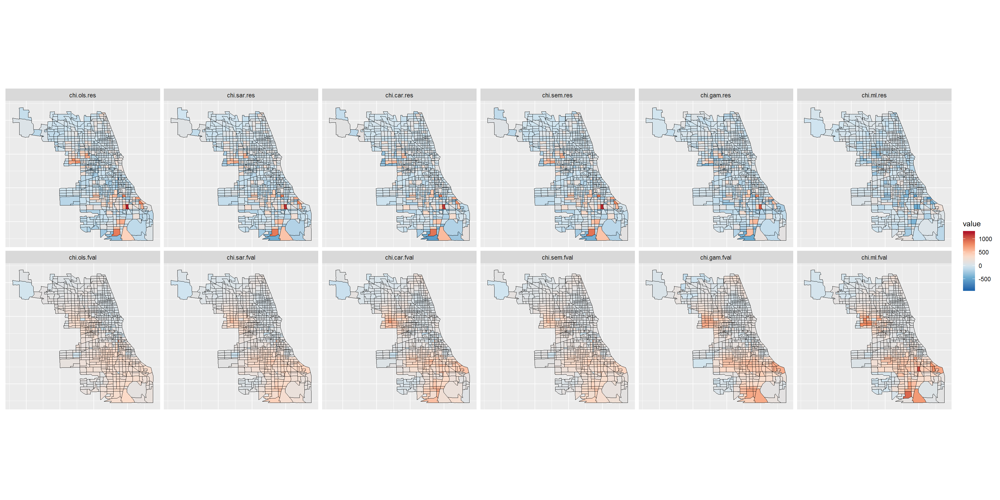
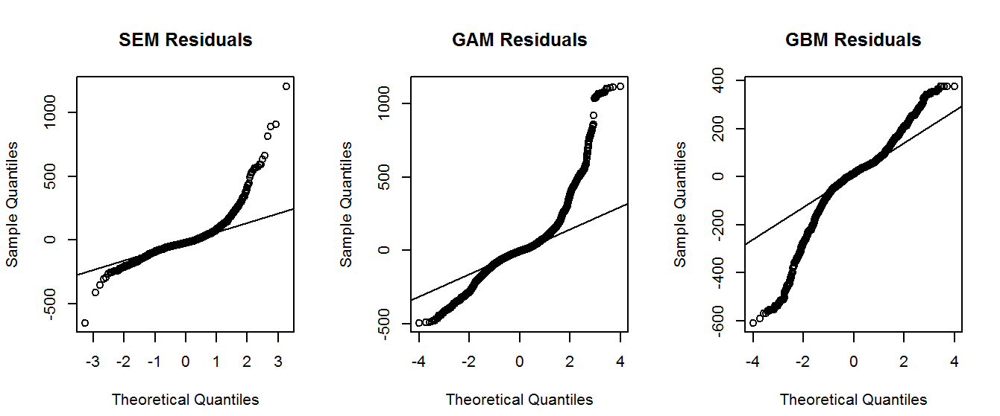
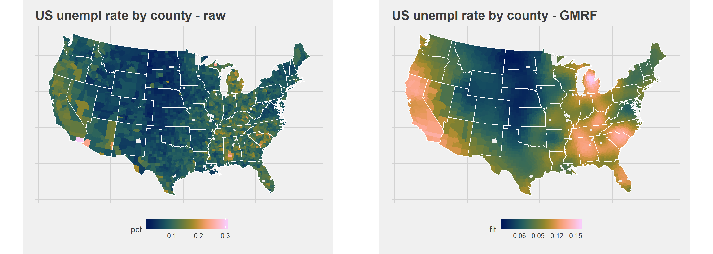
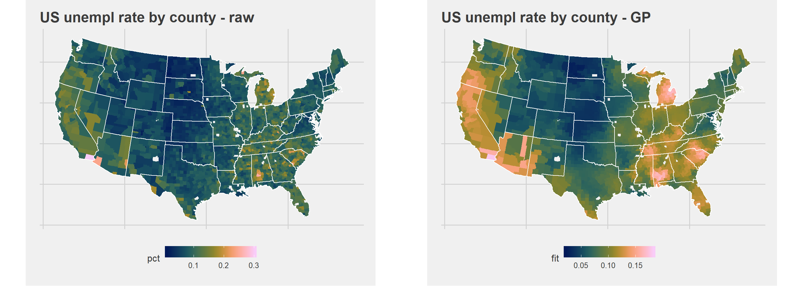

 

# Spatial correlations - few minimal examples

## Introduction 

Those minimal examples are done to illustrate the different models. I didn't follow the standard methodology. Especially, the models are fitted using the whole data set and the outcomes are compared loosely and in a visual way. However, the strengths and weaknesses can be grasped with those simple examples.
Moreover some methods to clean the data (filter the noise) might be applied but are not described here. I think of filtering out the noise of the correlation matrix. Pretty common for temporal correlation (especially in finance and physics), those methods might be applied to the spatial correlation matrix. To be investigated. 

## How to reproduce the results ? 

Please, see the Rmd file for details and the html file to see what should be the output when you run the entire notebook. To reproduce the results:

 - clone this repo
 - Install R and Rstudio (official stable version)
 - Install the libraries using (all are not required but I'm too lazy to sort them): 
 ```
install.packages(
   c(
   'spdep', 'maps', 'maptools', 'leaflet', 'rgdal',
   'viridis', 'RColorBrewer',
   'mgcv',
   'data.table',
   'caret',
   'tidyverse',
   'ggthemes',
   'plotly',
   'parallel', 'doParallel'
   )
 )
```
 - In the Rmd file, change the paths accordingly to the path where you cloned the repo (use Ctrl+F on `read_`, `D:/` and `C:/` to find all the inputs)

Then you're ready to knit or run the Rmd notebook. You can compare the resulting ouput with mine.

Enjoy ;)


## Preview

### Comparison of models - violent crimes in Michigan state

 
 

### Large scale smoothing - Gaussian processes and Gaussian Markov Random Fields

 
 


## Session info

```r
R version 3.5.1 (2018-07-02)
Platform: x86_64-w64-mingw32/x64 (64-bit)
Running under: Windows 7 x64 (build 7601) Service Pack 1

Matrix products: default

locale:
[1] LC_COLLATE=English_United States.1252  LC_CTYPE=English_United States.1252    LC_MONETARY=English_United States.1252
[4] LC_NUMERIC=C                           LC_TIME=English_United States.1252    

attached base packages:
[1] stats     graphics  grDevices utils     datasets  methods   base     

loaded via a namespace (and not attached):
 [1] tidyselect_0.2.4   Rook_1.1-1         purrr_0.2.5        lattice_0.20-35    colorspace_1.3-2   htmltools_0.3.6    viridisLite_0.3.0 
 [8] yaml_2.2.0         XML_3.98-1.16      rlang_0.2.2        pillar_1.3.0       glue_1.3.0         RColorBrewer_1.1-2 readxl_1.1.0      
[15] bindrcpp_0.2.2     bindr_0.1.1        plyr_1.8.4         stringr_1.3.1      munsell_0.5.0      gtable_0.2.0       cellranger_1.1.0  
[22] visNetwork_2.0.4   htmlwidgets_1.2    evaluate_0.11      knitr_1.20         DiagrammeR_1.0.0   broom_0.5.0        Rcpp_0.12.18      
[29] readr_1.1.1        backports_1.1.2    scales_1.0.0       jsonlite_1.5       rgexf_0.15.3       gridExtra_2.3      brew_1.0-6        
[36] ggplot2_3.0.0      hms_0.4.2          digest_0.6.17      stringi_1.1.7      dplyr_0.7.6        grid_3.5.1         rprojroot_1.3-2   
[43] influenceR_0.1.0   tools_3.5.1        magrittr_1.5       lazyeval_0.2.1     tibble_1.4.2       crayon_1.3.4       tidyr_0.8.1       
[50] pkgconfig_2.0.2    data.table_1.11.4  downloader_0.4     lubridate_1.7.4    assertthat_0.2.0   rmarkdown_1.10     rstudioapi_0.7    
[57] viridis_0.5.1      R6_2.2.2           igraph_1.2.2       nlme_3.1-137       compiler_3.5.1    
```